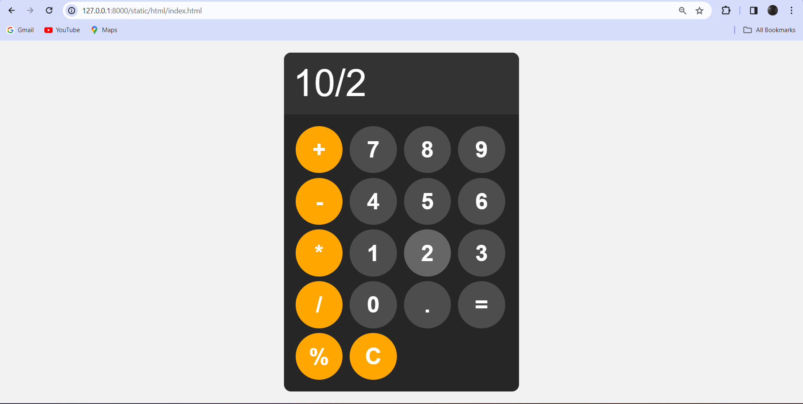

# Design of a Standard Calculator

## AIM:

To design a web application for a standard calculator.

## DESIGN STEPS:

### Step 1:
Fork the repository to your repository and clone it into vs code and start a django project.

### Step 2:
Now create the necessary files in the static folder for html,css and javascript.

### Step 3:
Add your code to the individual files and configure the settings.py to access the static files.

### Step 4:
Now using the command runserser start a django development server and access your calculator program


### Step 5:
Now push everything into your github

### Step 6:
Validate the HTML and CSS code.

### Step 7:
Publish the website in the given URL.

## PROGRAM :
### HTML : 
```
<!DOCTYPE html>
<html lang="en">
<head>
    <meta charset="UTF-8">
    <meta name="viewport" content="width=device-width, initial-scale=1.0">
    <title>Calculator</title>
    <link rel="stylesheet" href="style/style.css">
</head>
<body>
    <div id="calculator">
        <input type="text"id="display" readonly>
        <div id="keys">
            <button onclick="appendToDisplay('+')" class="operator-btn">+</button>
            <button onclick="appendToDisplay('7')">7</button>
            <button onclick="appendToDisplay('8')">8</button>
            <button onclick="appendToDisplay('9')">9</button>
            <button onclick="appendToDisplay('-')" class="operator-btn">-</button>
            <button onclick="appendToDisplay('4')">4</button>
            <button onclick="appendToDisplay('5')">5</button>
            <button onclick="appendToDisplay('6')">6</button>
            <button onclick="appendToDisplay('*')" class="operator-btn">*</button>
            <button onclick="appendToDisplay('1')">1</button>
            <button onclick="appendToDisplay('2')">2</button>
            <button onclick="appendToDisplay('3')">3</button>
            <button onclick="appendToDisplay('/')" class="operator-btn">/</button>
            <button onclick="appendToDisplay('0')">0</button>
            <button onclick="appendToDisplay('.')">.</button>
            <button onclick="calculate()">=</button>
            <button onclick="appendToDisplay()" class="operator-btn">%</button>
            <button onclick="cleardisplay()" class="operator-btn">C</button>
        </div>
    </div>


    <script src="script/index.js"></script>
</body>
</html>

```

### CSS :
```
button{
    width: 100px;
    height: 100px;
    border-radius: 50px;
    border: none;
    background-color: hsl(0, 0%, 30%);
    color: white;
    font-size: 3rem;
    font-weight: bold;
    cursor: pointer;

}
button:hover{
    background-color: hsl(0, 0%, 40%);
}
button:active{
    background-color: hsl(0, 0%, 50%);
}
#keys{
    display: grid;
    grid-template-columns: repeat(4, 1fr);
    gap: 10px;
    padding: 25px;
}
#calculator{
    font-family: 'Arial';
    background-color: hsl(0,0%,15%);
    border-radius: 15px;
    max-width: 500px;
    overflow: hidden;
}
#display{
    width: 100%;
    padding: 20px;
    font-size: 5rem;
    text-align: left;
    border: none;
    background-color: hsl(0,0%,20%);
    color: white;
}
body{
    margin: 0;
    display: flex;
    justify-content: center;
    align-items: center;
    height: 100vh;
    background-color: hsl(0,0%,95%);
}
.operator-btn{
    background-color: hsl(39,100%,50%);
}
.operator-btn:hover{
    background-color: hsl(39,100%,65%);
}
.operator-btn:active{
    background-color: hsl(39,100%,75%);
}
```
### Javascript:
```
const display = document.getElementById("display");

function appendToDisplay(input)
{
    display.value += input;
}
function cleardisplay(){
    display.value = "";
}
function calculate()
{
    try{
        display.value = eval(display.value);
    }
    catch(error){
        display.value = "Syntax error";
    }
}

```

## OUTPUT:



## Result:
The calculator application has been created succesfully.
